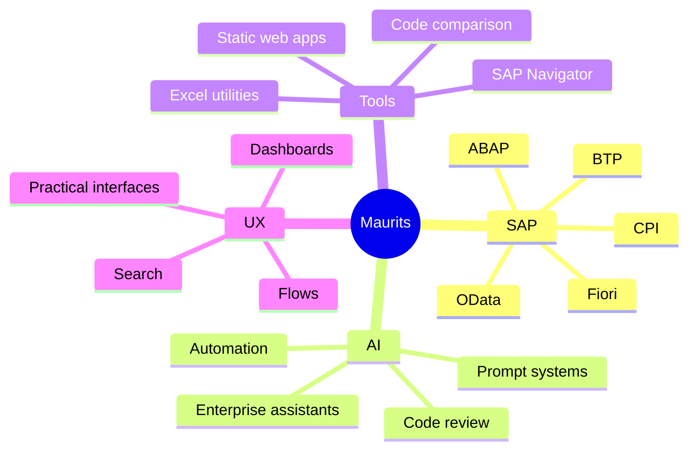

<div align="center">


<br/>


<br/><br/>

<a href="https://sapnav.dk">
  
</a>
<a href="https://maurits2905.github.io/MauritsPuggaard/">
  
</a>
<a href="https://www.linkedin.com/in/maurits-puggaard-4095351b0">
  
</a>

<br/><br/>


</div>

---

## `whoami`

```txt
Name:        Maurits Puggaard
Role:        SAP Technical Consultant
Company:     SOA People Nordic
Focus:       SAP development, integrations, AI workflows and practical tooling
Location:    Denmark
Mode:        Building useful things, not just nice-looking things
```

I work with SAP development, integrations and AI-driven tools.  
My sweet spot is turning complex enterprise systems into something easier to search, understand, automate and actually use.

I like building small but useful products around real problems: SAP navigation, code comparison, Excel handling, daily tracking, simulations and developer utilities.

---

## Current signal

<table>
<tr>
<td width="50%">

### What I build

- SAP tools that reduce friction
- Static web apps with practical value
- OData, CPI and integration utilities
- AI-assisted review and automation workflows
- Developer tools for comparing, searching and validating data

</td>
<td width="50%">

### What I care about

- Clean user experience
- Simple architecture
- No unnecessary backend
- Fast iteration
- Tools that solve actual work problems

</td>
</tr>
</table>

---

## Featured build: SAP Navigator

<div align="center">

<a href="https://sapnav.dk">
  
</a>
<a href="https://github.com/maurits2905/sap-navigator">
  
</a>

</div>

<br/>

**SAP Navigator** is a lightweight SAP helper site for finding transactions, decoding issues and following troubleshooting flows.

It is built around a simple idea:

> SAP users should not have to remember every transaction, table, object or flow. They should be able to describe what they need and get useful direction fast.

### Core ideas

| Area | Description |
|---|---|
| Find | Search for the right SAP transaction from a task or object |
| Decode | Map symptoms and errors to likely next steps |
| Flows | Follow common troubleshooting and navigation paths |
| Tables | Look up relevant SAP standard tables |
| Favorites | Keep useful flows and references close |
| Architecture | Static site, local JSON, no backend, no database, no runtime AI cost |

---

## Tech stack

<div align="center">

### SAP & Enterprise


<br/><br/>

### Web, tools and automation


<br/><br/>


</div>

---

## Project map

<table>
<tr>
<td width="50%">

### SAP Navigator

A static SAP helper site for finding transactions, decoding issues and following troubleshooting flows.

**Stack:** `HTML` `CSS` `JavaScript` `GitHub Pages`  
**Focus:** SAP search, tables, flows, local-first architecture

<a href="https://github.com/maurits2905/sap-navigator">Open repo</a>

</td>
<td width="50%">

### AntLab

A browser-based ant simulation with pheromone trails, visual modes, heatmaps, obstacles and generative art effects.

**Stack:** `TypeScript`  
**Focus:** Simulation, visual systems, interaction design

<a href="https://github.com/maurits2905/AntLab">Open repo</a>

</td>
</tr>

<tr>
<td width="50%">

### DailyHub

A personal daily puzzle dashboard for tracking Wordle, NYT Games, LinkedIn Games and other daily challenges.

**Stack:** `JavaScript`  
**Focus:** Tracking, streaks, game dashboard, daily routines

<a href="https://github.com/maurits2905/DailyHub">Open repo</a>

</td>
<td width="50%">

### Compare Code Program

Upload old and new exports, map columns, filter by author/object and compare by key.

**Stack:** `HTML`  
**Focus:** Code comparison, export validation, practical work utility

<a href="https://github.com/maurits2905/Compare_code_program">Open repo</a>

</td>
</tr>

<tr>
<td width="50%">

### Excel Merge

A web-based tool to merge multiple Excel files into one workbook while preserving sheets as tabs.

**Stack:** `HTML`  
**Focus:** Office automation, file handling, simple workflows

<a href="https://github.com/maurits2905/EXCEL_MERGE">Open repo</a>

</td>
<td width="50%">

### Work Time Calculator

A simple calculator for tracking internal and billable work time.

**Stack:** `HTML`  
**Focus:** Time tracking, work utilities, everyday automation

<a href="https://github.com/maurits2905/WORK_TIME_CALCULATOR">Open repo</a>

</td>
</tr>
</table>

---

## Certifications

<div align="center">


<br/><br/>


</div>

---

## GitHub stats

<div align="center">


<br/><br/>


</div>

---

## Contribution flow

<div align="center">


</div>

---

## How I think about building

```txt
Start with the real workflow.
Find the friction.
Remove the unnecessary parts.
Make the tool fast enough to become a habit.
Keep the architecture simple enough to maintain.
```

---

## Focus areas right now



---

## Contact

<div align="center">

I am always interested in practical SAP, AI, automation and developer-tool ideas.

<br/><br/>

<a href="https://sapnav.dk">
  
</a>
<a href="https://maurits2905.github.io/MauritsPuggaard/">
  
</a>
<a href="https://www.linkedin.com/in/maurits-puggaard-4095351b0">
  
</a>

<br/><br/>


</div>
